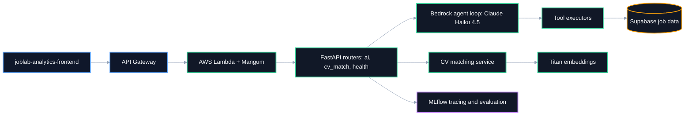
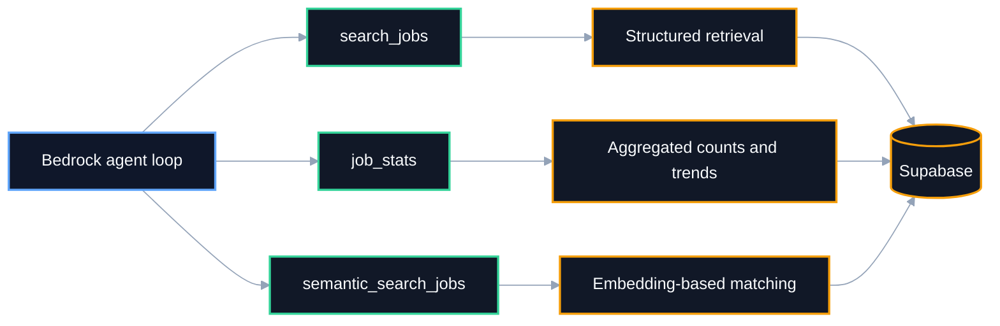
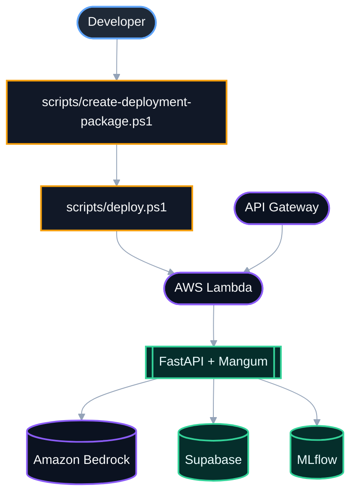

# JobLab Agent API

FastAPI backend for **AI-powered** job search, **CV matching**, **tool-calling** agent workflows, and **MLflow**-traced evaluation, deployed on **AWS Lambda**.


> ⭐ If this repository is useful for your work or research, consider starring it.

## Overview

This is the AI backend behind the **JobLab** product family. It runs a **custom tool-calling agent loop** on top of **Amazon Bedrock** (not LangChain, LangGraph, or Bedrock AgentCore — a deliberate, dependency-light orchestration layer built directly on the Bedrock Converse API), and exposes three product capabilities:

- **AI chat orchestration** for job-related questions, with prompt-policy construction, conversation memory, and confidence-gated answers (answer / clarify / decline / handoff)
- **CV matching** using Bedrock Titan embeddings and similarity scoring against job postings
- **Direct, structured job search** against a **Supabase**-backed dataset

It also carries a full **MLOps layer**: every chat turn is traced through **MLflow**, with a 4-stage pipeline (`MLFLOW_STEPS/`) for experiment setup, asset registration, baseline evaluation, and iterative prompt/agent optimization.

**This repository is best described as:**

- A custom Bedrock agent loop (Claude Haiku 4.5) with three callable tools, not a framework wrapper
- A production evaluation harness — MLflow tracing, custom scorers, and an optimization loop, not just an inference endpoint
- A serverless deployment — FastAPI + Mangum on AWS Lambda behind API Gateway

## Tech stack

| Component | Responsibility | Tech |
|---|---|---|
| API / serving | HTTP layer | FastAPI + Mangum |
| Compute | Serverless deployment | **AWS Lambda** + API Gateway |
| LLM | Agent reasoning | **Amazon Bedrock** — Claude Haiku 4.5 (`us.anthropic.claude-haiku-4-5-20251001-v1:0`) |
| Embeddings | CV ↔ job similarity | Bedrock Titan Embed Text v2 (512-dim) |
| Job data | Structured retrieval | **Supabase** (Postgres) |
| CV storage | Uploaded CV artifacts | S3 |
| Observability | Tracing, evaluation, optimization | **MLflow** (self-hosted tracking server) |
| Fallback | Durable trace delivery | S3-backed spool-and-forward for MLflow Lite |

## Architecture



Routing lives in [`app/main.py`](app/main.py), the Lambda entrypoint in [`lambda_handler.py`](lambda_handler.py), AI orchestration in [`app/routers/ai.py`](app/routers/ai.py), CV matching in [`app/routers/cv_match.py`](app/routers/cv_match.py), and configuration in [`app/config.py`](app/config.py).

### Tool layer

The agent exposes three tools via [`TOOL_DEFINITIONS`](app/services/joblab_tools.py) / [`TOOL_EXECUTORS`](app/services/joblab_tools.py):

1. **`search_jobs`** — structured retrieval by role, country, remote status, level, platform, tools, and posting date
2. **`job_stats`** — aggregated counts, distributions, and comparisons for trend-style questions
3. **`semantic_search_jobs`** — embedding-based retrieval for concept-driven questions where keyword matching falls short



## MLflow and optimization

Beyond inference, this repo carries a full experimentation layer under [`MLFLOW_STEPS/`](MLFLOW_STEPS/) and [`evals/`](evals/):

- **Production tracing** — every chat turn, tool call, and latency logged via [`app/services/mlflow_lite.py`](app/services/mlflow_lite.py), with an S3-backed spool so traces survive tracking-server downtime
- **Experiment + asset registration** — [`step1_create_experiment.py`](MLFLOW_STEPS/step1_create_experiment.py), [`step2_register_assets.py`](MLFLOW_STEPS/step2_register_assets.py)
- **Baseline evaluation** — [`step3_run_evaluation.py`](MLFLOW_STEPS/step3_run_evaluation.py) with custom scorers in [`evals/mlflow_scorers.py`](evals/mlflow_scorers.py)
- **Iterative optimization** — [`step4_optimization.py`](MLFLOW_STEPS/step4_optimization.py) against a defined [optimization contract](evals/optimization_contract.py)

Design rationale is documented in [`MLFLOW_STEPS/MLFLOW_AGENT_OBSERVABILITY_STANDARD.md`](MLFLOW_STEPS/MLFLOW_AGENT_OBSERVABILITY_STANDARD.md).

## Quickstart

```bash
git clone https://github.com/Mbehbahani/joblab-agent-api.git
cd joblab-agent-api
python -m venv .venv && .venv\Scripts\Activate.ps1
pip install -r requirements.txt
cp .env.example .env   # fill in AWS/Supabase/MLflow values
uvicorn app.main:app --reload
```

Open <http://localhost:8000/docs>.

## Configuration

All variables are documented in [`.env.example`](.env.example).

| Variable | Required | Description |
|---|---|---|
| `BEDROCK_MODEL_ID` | yes | Bedrock chat model (Claude Haiku 4.5 inference profile) |
| `BEDROCK_EMBED_MODEL_ID` | yes | Titan embedding model for CV matching |
| `SUPABASE_URL` | yes | Supabase project URL |
| `SUPABASE_SERVICE_ROLE_KEY` | yes | Server-side key for job data access |
| `CORS_ORIGINS` | yes | Allowed frontend origins |
| `S3_CV_BUCKET` | optional | Bucket for CV storage |
| `MLFLOW_TRACKING_URI` | optional | Primary MLflow tracking server |
| `MLFLOW_TRACKING_URI_FALLBACK` | optional | Direct-DB fallback if the tracking server is unreachable |
| `MLFLOW_SPOOL_ENABLED` | optional | S3-backed durable trace delivery |

## API surface

- AI ask / feedback flows — [`app/routers/ai.py`](app/routers/ai.py)
- CV matching (text and PDF) — [`app/routers/cv_match.py`](app/routers/cv_match.py)
- Health/diagnostics — [`app/routers/health.py`](app/routers/health.py)

## Project structure

```text
.
├── app/
│   ├── config.py
│   ├── main.py
│   ├── routers/          # ai, cv_match, health
│   ├── schemas/
│   └── services/          # bedrock, embeddings, joblab_tools, mlflow_lite, cv_service, s3_cv_store...
├── evals/                  # MLflow scorers, optimization contract
├── MLFLOW_STEPS/            # 4-stage experiment/eval/optimization pipeline
├── scripts/                  # deploy, rollback, update-lambda, mlflow-local
├── lambda_handler.py
├── requirements.txt
├── requirements-lambda.txt
├── .env.example
├── LICENSE
└── README.md
```

## Deployment

FastAPI wrapped by Mangum, deployed to **AWS Lambda**, exposed through **API Gateway**, connected to Bedrock, Supabase, and MLflow.



Rollback is scripted via [`scripts/rollback-lambda.ps1`](scripts/rollback-lambda.ps1); environment variables are synced with [`scripts/update-environment.ps1`](scripts/update-environment.ps1).

## Roadmap / TO-DO

- [ ] Publish `evals/` baseline metrics in this README
- [ ] Add CI (lint + test) via `.github/workflows/`
- [ ] Docker image for non-Lambda deployment targets

## Related links

- [joblab-analytics-frontend](https://github.com/Mbehbahani/joblab-analytics-frontend) — dashboard and chat UI consuming this API
- [joblab-data-pipeline](https://github.com/Mbehbahani/joblab-data-pipeline) — scraping/enrichment pipeline feeding the Supabase job data this agent searches

## Security note

This repository's git history was scrubbed of hardcoded AWS credentials and a database connection string with `git-filter-repo` prior to publication. Those credentials have been rotated.

## License

[MIT](LICENSE) © 2026 M.Behbahani
